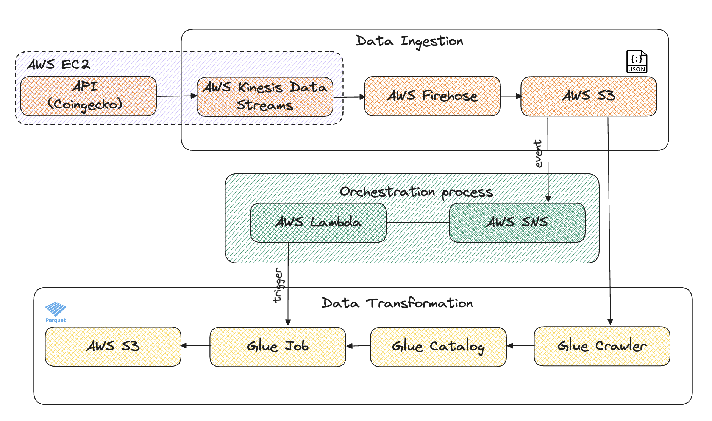

## AWS Streaming Pipeline for real-time Cryptocurrency Price analysis

This AWS streaming pipeline ingests real-time Cryptocurrency price data from the CoinGecko API, transform it for analysis and stores it in a ready-to-use format. The pipeline leverage the following services:
- **AWS Kinesis and Firehose**: Continuously streams data from the CoinGecko API in real-time.I also implement data partitioning within Firehose to improve performance. 
- **Amazon S3**: Serves as the data lake for storing the raw cryptocurrency price data.
- **AWS Glue**: Provides a job to transform the raw data into a schema optimized for analytics.
- **AWS Lambda**: Acts as an event-driven trigger, initiating the Glue job whenever new data arrives in the S3 raw layer.
- **Amazon SNS**: Publishes notifications (in SNS's topic) about new data arrivals in S3, which are then picked up by the Lambda function.

This architecture ensures that the pipeline automatically processes incoming data, keeping the analytical layer up-to-date with the lastest information. 

